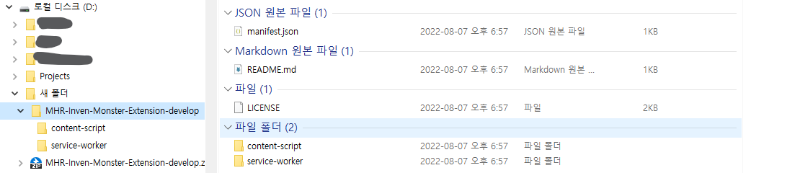
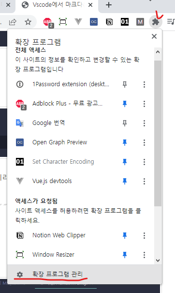
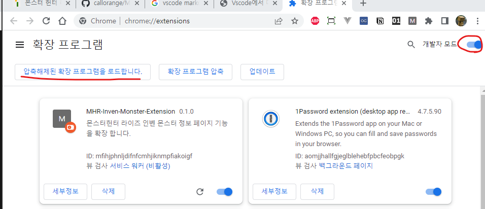
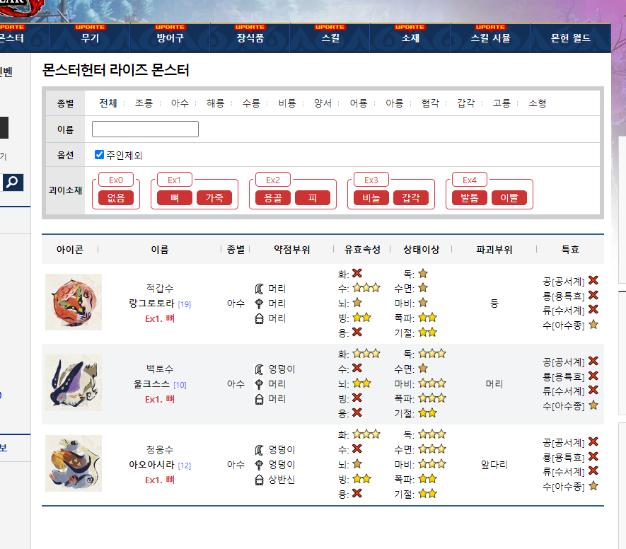

# MHR-Inven-Monster-Extension

몬스터헌터 라이즈 인벤 몬스터 정보 페이지 기능을 확장하는 Chrome Extension.

몬헌 인벤 몬스터 페이지 보다가 검색이 답답해서 만듦.

## 기능
1. 인벤 몬스터 검색 페이지로 이동
    - 확장프로그램 아이콘 클릭시 페이지 이동

2. 검색기능 추가
    1. 이름 검색 기능 확장
        1. 여러 이름으로 검색
            - ex) 가란/디아 => 가란고르무, 디아블로
            - `가란` 혹은 `디아`가 들어가는 것만

        2. 이름에 특정 문구가 들어가는 것만
            - ex) 리@이아 => 리오레이아, 주인 리오레이아
            - `리`와 `이아` 가 모두 들어가는 것만

        3. 이름에 특정 문구가 제외
            - ex) 야츠!아종 => 야츠카다키
            - `야츠`가 들어가는 것 중 `아종`이 없는 것만

        4. 조합
            - ex) 야츠!아종/벨리 => 야츠카다키, 벨리오로스

    2. 괴이화 정보별 리스트
        - 클릭시 괴이 레벨 혹은 재료별 몬스터 검색

    3. 주인 몬스터 제외
        - 주인몬스터는 자동으로 제외하도록 체크 가능
        - 체크 여부는 저장되어 자동 로드

3. 몬스터 정보 추가
    1. 괴이화 정보 추가
    2. 특효 스킬 추가

## 설치
1. 압축파일을 다운로드 받는다.
    - 
2. 압축을 해제한다
    - 
3. 확장프로그램 관리 페이지로 이동
    - [chrome://extensions/](chrome://extensions/)
    - 
4. 확장 프로그램 추가
    1. 개발자모드 ON
    2. 압축해제된 확장프로그램 로드
        - 2번에서 압축해제한 폴더 지정
        - 

## 적용화면
