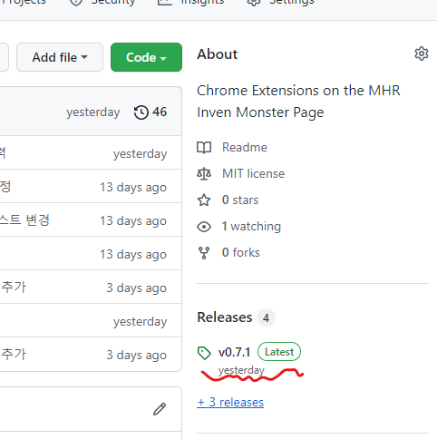
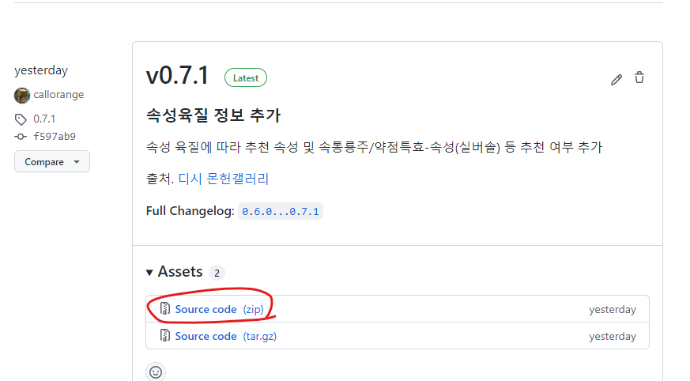
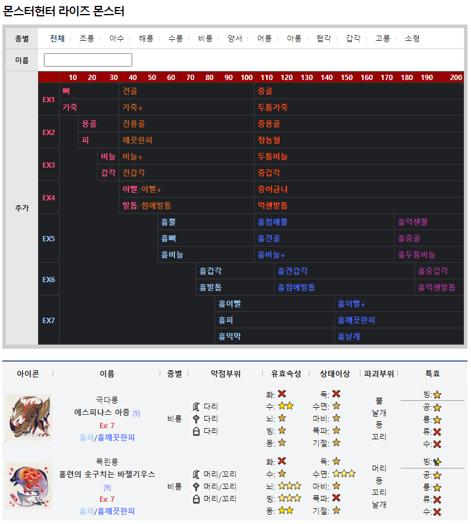

# MHR-Inven-Monster-Extension

몬스터헌터 라이즈 인벤 몬스터 정보 페이지 기능을 확장하는 Chrome Extension.

몬헌 인벤 몬스터 페이지 보다가 검색이 답답해서 만듦.

## 기능
1. 인벤 몬스터 검색 페이지로 이동
    - 확장프로그램 아이콘 클릭시 페이지 이동

2. 검색기능 추가
    1. 이름 검색 기능 확장
        1. 여러 이름으로 검색
            - ex) `가란/디아` => `가란고르무`, `디아블로`
            - `가란` 혹은 `디아`가 들어가는 것

        2. 주인, 아종, 희소종 제외
            - ex) `레이아!` => `리오레이아`
            - `레이아`가 들어가 있는것중 `주인`, `아종`, `희소종` 들어가 있는 것 제외
            - ex) `!야츠` => `야츠카다키`
            - `야츠`가 들어가 있는것중 `주인`, `아종`, `희소종` 들어가 있는 것 제외

        3. 희소종만 검색
            - ex) `레이아@` => `리오레이아 희소종`
            - `레이아`와 `희소종`이 들어가 있는 것만 검색

        4. 주인만 검색
            - ex) `레이아#` => `주인 리오레이아`
            - `레이아`와 `주인`이 들어가 있는 것만 검색

        5. 조합
            - ex) `야츠!/벨리/레이아@` => `야츠카다키`, `벨리오로스`, `리오레이아 희소종`

    2. 괴이화 정보별 리스트
        - 클릭시 괴이 레벨 혹은 재료별 몬스터 검색

3. 몬스터 정보 추가
    1. 괴이화 정보 추가
    2. 특효 스킬 추가
    3. 속성육질 정보 추가
        - [출처: 디시 몬헌 갤러리](https://gall.dcinside.com/capcommh/150)
        - 속통룡주: 🌠
        - 약점특효-속성(실버솔): ⭐
        - 속성 비추천: ⚠️
    4. 특효주(물리데미지) 추가
        - 적용 : ⭐
        - 비적용 : ❌

## 설치
1. 압축파일을 다운로드 받는다.
    - 
    - 
2. 압축을 해제한다
    - 
3. 확장프로그램 관리 페이지로 이동
    - [chrome://extensions/](chrome://extensions/)
    - 
4. 확장 프로그램 추가
    1. 개발자모드 ON
    2. 압축해제된 확장프로그램 로드
        - 2번에서 압축해제한 폴더 지정
        - 

## 적용화면

## History
- 0.7.0
    - 속성 육질 추가
- 0.7.1
    - 속성 육질에 따라 이모지 추가
- 0.7.2
    - 원망 마가도 정보 수정
    - 검색시 화면 스크롤 위치 조정
- 0.7.3
    - 괴이소재 검색버튼 인게임 소재 정렬과 맞춤
- 0.8.0
    - 공략속성 추천 오류 수정 및 데이터 타입 변경
- 1.0.0
    - 검색창 UI 변경
- 1.0.1
    - 괴이 소재 추가 및 UI 변경
    - 몬스터 이름 검색 방법 변경
    - 기타 오류 수정